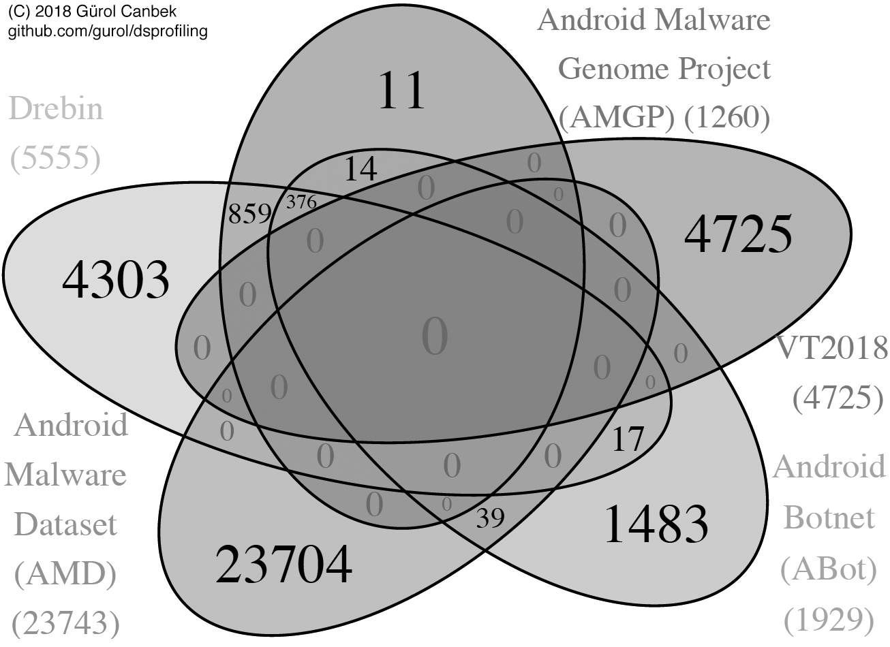

## DsProfiling – Dataset Profiling: A Research Compedium of
# New Techniques in Profiling Big Datasets for Machine Learning with A Concise Review of Android Mobile Malware Datasets

   

This platform is a research compedium of our academic publication below.

> [Gürol Canbek](http:gurol.canbek.com/Publications), Seref Sagiroglu, and Tugba Taskaya Temizel. “*New Techniques in Profiling Big Datasets for Machine Learning with A Concise Review of Android Mobile Malware Datasets*”, International Congress on Big Data, Deep Learning & Fighting Cyber Terrorism (IBIGDELFT 2018), 3–4 December 2018: IEEE.

Full-text is available at [ResearchGate](https://www.researchgate.net/publication/329389722_New_Techniques_in_Profiling_Big_Datasets_for_Machine_Learning_with_A_Concise_Review_of_Android_Mobile_Malware_Datasets) and [IEEE Xplore](https://ieeexplore.ieee.org/document/8625275). The contents:
* \*
* with novel  - An R script to calculate some of the profiling criteria (will be updated later)
* The presentation given in the conference is also available.

\* Best viewed with [LibreOffice](https://www.libreoffice.org/download/libreoffice-fresh/).

*Example figure visualizing a profiling criteria (colored version is in the article)*

## Contents of Tables/Extra Material
* **Table I.**	Reviewed Android Mobile Malware Datasets
* **Table II.**	Basic Profiling
* **Table III.**	Time Line Profiling
* **Table IV.**	Density/Sparsity Profiling
* **Table V.**	Overall Profiling Results
* **Table Extra I.**	Datasets Usage in the Literature
* **Table Extra II.**	Dataset Sizes
* **Table Extra III.**	Android Mobile Malware Family and Variants

Please, refer to the article for more information and methodology (a link will be provided).

## Abstract
As the volume, variety, velocity aspects of big data are increasing, the other aspects such as veracity,  value, variability, and venue could not be interpreted easily by data owners or researchers. The aspects are also unclear if the data is to be used in machine learning studies such as classification or clustering. This study proposes four techniques with fourteen criteria to systematically profile the datasets collected from different resources to distinguish from one another and see their strong and weak aspects. The proposed approach is demonstrated in five Android mobile malware datasets in the literature and in security industry namely Android Malware Genome Project, Drebin, Android Malware Dataset, Android Botnet, and Virus Total 2018. The results have shown that the proposed profiling methods reveal remarkable insight about the datasets comparatively and directs researchers to achieve big but more visible, qualitative, and internalized datasets.

## Keywords
Data profiling, data quality, big data, malware detection, mobile malware, machine learning, classification, Android, feature engineering
